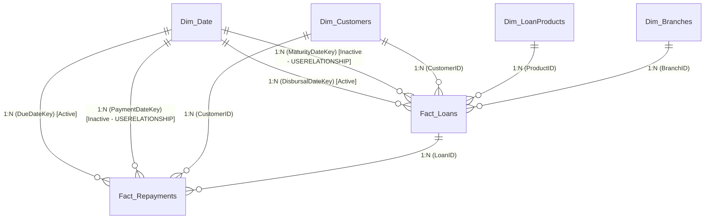

# 🏦 FinPulse 360: Retail & Commercial Banking Credit Risk & Loan Intelligence
> **Enterprise Power BI Portfolio Project | Data Analytics & Risk Intelligence**


---

## 📌 Project Overview
**FinPulse 360** is an enterprise-grade Banking Credit Risk, Loan Portfolio Performance, and Early Delinquency Management dashboard for **Apex Global Bank**, managing a **$485M+ credit portfolio across 5,000 active loans and 1,000 borrowers** across 12 branch hubs.

This project delivers actionable risk monitoring, early delinquency intervention (30-60 DPD), customer credit scoring profiling, and macroeconomic What-If stress testing.

---

## 🚀 Live Interactive Dashboard Preview
Try the interactive web simulator directly in your browser:
👉 **[Launch FinPulse 360 Interactive Simulator](preview_app/index.html)** *(or via GitHub Pages)*

---

## 📐 Data Architecture (Star Schema)

The data model follows an optimized **Star Schema** with single-direction filtering to maximize VertiPaq columnar compression:



---

## 📊 4-Page Dashboard Visual Architecture

1. **Page 1: Executive Portfolio Command Center**:
   - High-level KPIs: Total Disbursed Volume ($485.2M), Gross NPA Ratio (3.24%), Weighted Average Interest Rate (8.42% WAIR), and Collection Efficiency (94.8%).
   - Monthly Disbursals vs 3-Month Moving Average (Line/Area).
   - Product Category Allocation & Branch Risk Matrix with heatmaps.
2. **Page 2: Delinquency & PAR 30+ Early Warning Matrix**:
   - Delinquency aging migration (Current $\rightarrow$ 1-30 $\rightarrow$ 31-60 $\rightarrow$ 61-90 $\rightarrow$ Default).
   - Scatter risk quadrant (Collection Efficiency vs NPA %).
   - Actionable delinquency recovery call-list for branch recovery teams.
3. **Page 3: Borrower Risk Profile & Credit Scoring**:
   - FICO Credit Score distribution (Exceptional to Poor).
   - Debt-to-Income (DTI) vs Annual Income cross-risk matrix.
4. **Page 4: Dynamic What-If Stress Testing Simulator**:
   - Interactive sliders for Macro Default Spike (0-25%) and Rate Hikes (0-300 bps).
   - Real-time simulation of Stressed NPAs and Additional Capital Provisions required under Basel III.

---

## 💡 Key DAX Measures Implemented

### 1. Gross NPA Ratio (%)
```dax
Gross NPA Ratio % = 
DIVIDE(
    CALCULATE(
        [Total Disbursed Amount],
        Fact_Loans[IsNonPerformingAsset] = 1
    ),
    [Total Disbursed Amount],
    0
)
```

### 2. Weighted Average Interest Rate (WAIR)
```dax
WAIR = 
DIVIDE(
    SUMX(
        Fact_Loans,
        Fact_Loans[LoanAmountUSD] * Fact_Loans[InterestRate]
    ),
    [Total Disbursed Amount],
    BLANK()
)
```

### 3. Expected Credit Loss (ECL Provisioning)
```dax
Expected Credit Loss (ECL) = 
SUMX(
    Fact_Loans,
    VAR _PD = SWITCH(Fact_Loans[ApprovalRiskRating],
        "AAA - Low Risk", 0.015,
        "BBB - Moderate Risk", 0.045,
        "CCC - Elevated Risk", 0.140,
        "DDD - High Default Probability", 0.350,
        0.05
    )
    VAR _LGD = 0.45
    VAR _EAD = Fact_Loans[LoanAmountUSD]
    RETURN _EAD * _PD * _LGD
)
```

### 4. Dynamic Row-Level Security (RLS)
```dax
[ManagerEmail] = USERPRINCIPALNAME()
```

---

## 🛠️ Tech Stack & Skills Demonstrated
- **Tools**: Microsoft Power BI Desktop & Service, Power Query (M Language), DAX Studio, Git/GitHub.
- **Concepts**: Star Schema Data Modeling, Granularity Management, Time Intelligence, Dynamic RLS, Disconnected Parameters (What-If Analysis).
- **Domain**: Banking & Financial Services (BFSI), Credit Risk Scoring (FICO), Basel III Loss Provisioning, Delinquency Aging (DPD).

---

## 📂 Repository Structure
```
├── data/                                 # 6 Normalized CSV Datasets
│   ├── Fact_Loans.csv
│   ├── Fact_Repayments.csv
│   ├── Dim_Customers.csv
│   ├── Dim_Branches.csv
│   ├── Dim_LoanProducts.csv
│   └── Dim_Date.csv
├── documentation/                        # Complete Technical & Interview Guides
│   ├── 01_PROJECT_EXECUTIVE_SUMMARY.md
│   ├── 02_DATA_MODEL_AND_RELATIONSHIPS.md
│   ├── 03_POWER_QUERY_M_TRANSFORMATIONS.md
│   ├── 04_COMPLETE_DAX_MEASURE_DICTIONARY.md
│   ├── 05_REPORT_DESIGN_AND_VISUAL_BLUEPRINT.md
│   ├── 06_ROW_LEVEL_SECURITY_RLS.md
│   └── 07_FRESHER_INTERVIEW_PREP_PLAYBOOK.md
└── preview_app/                          # Interactive Web Simulator
    ├── index.html
    ├── style.css
    └── app.js
```
