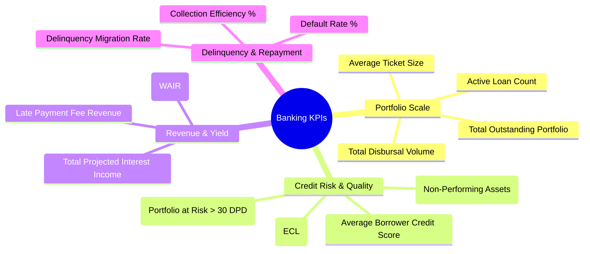

# 01. Project Executive Summary & Business Case

## Project Title
**FinPulse 360: Retail & Commercial Banking Credit Risk, Loan Performance & Early Delinquency Warning Command Center**

---

## 1. Executive Context & Industry Background
In modern retail and commercial banking, lending represents the primary revenue driver through net interest income. However, credit portfolios face severe risks from macroeconomic fluctuations, inflation, interest rate hikes, and borrower delinquency.

**Apex Global Bank** manages an active retail and commercial credit portfolio of **$485M+ across 5,000 active loan accounts and 1,000 corporate/individual borrowers** spanning 12 strategic branch hubs in 4 regional territories.

### The Business Challenge:
1. **Rising Non-Performing Assets (NPAs)**: Delinquencies beyond 90 days past due (DPD) erode capital reserves due to regulatory provisioning requirements (Basel III / IFRS 9).
2. **Delayed Intervention**: Branch managers lacked early-warning signals for borrowers transitioning from 1–30 DPD to 61–90 DPD, missing the critical window for loan restructuring.
3. **Concentration Risk**: Executive leadership lacked visibility into cross-segment risk exposure (e.g., high Debt-to-Income (DTI) ratios among unsecured flexi-loans).
4. **Disjointed Reporting**: Risk officers, branch managers, and C-suite executives relied on static, disparate weekly Excel spreadsheets with zero cross-filtering or scenario modeling capabilities.

---

## 2. Project Objectives & Value Delivered
This Power BI solution was engineered to transform raw transaction and repayment logs into an **interactive risk control center**:

| Objective | Business Metric Impact |
| :--- | :--- |
| **Portfolio Health Monitoring** | Real-time tracking of Total Disbursed Capital, Active Book Balance, and Weighted Average Interest Rate (WAIR). |
| **Delinquency Mitigation** | Identifying 30-day and 60-day delinquency migration before accounts enter default status (90+ DPD). |
| **Risk-Based Customer Segmentation** | Visualizing DTI vs Credit Score (FICO) to identify subprime borrower risk clusters. |
| **Stress Testing & What-If Modeling** | Simulating portfolio loss provisions under simulated default rate spikes and interest rate hikes. |
| **Granular Security Governance** | Role-Level Security (RLS) ensuring Branch Managers only access their branch data while Regional Directors view aggregated territories. |

---

## 3. Key Banking Performance Indicators (KPIs) Defined

### Core Metric Formulas:
1. **Non-Performing Asset (NPA) Ratio (%)**:
   $$\text{NPA Ratio} = \frac{\text{Outstanding Balance of 90+ DPD Loans}}{\text{Total Outstanding Loan Portfolio}} \times 100$$
2. **Collection Efficiency (%)**:
   $$\text{Collection Efficiency} = \frac{\text{Actual Total Repayments Collected}}{\text{Total Scheduled EMI Dues}} \times 100$$
3. **Portfolio at Risk (PAR 30+) (%)**:
   $$\text{PAR 30+} = \frac{\text{Total Loan Value with DPD} > 30}{\text{Total Active Portfolio Value}} \times 100$$
4. **Weighted Average Interest Rate (WAIR)**:
   $$\text{WAIR} = \frac{\sum (\text{Loan Amount} \times \text{Interest Rate})}{\sum \text{Loan Amount}}$$

---

## 4. Target Stakeholder Personas & Use Cases

1. **Chief Risk Officer (CRO) & Credit Committee**:
   - Focus: NPA trends, Macro Credit Loss Provisioning, Product Risk Tier exposure.
   - Action: Adjust underwriting criteria and loan approval policies.
2. **Regional Sales & Branch Managers**:
   - Focus: Branch collection efficiency, high-risk borrower contact lists, branch target attainment.
   - Action: Mobilize recovery teams for accounts in the 1–30 DPD early bucket.
3. **Credit Underwriters & Risk Analysts**:
   - Focus: Borrower DTI distributions, collateral coverage ratios, credit score band migration.
   - Action: Set risk-adjusted pricing and determine collateral requirements.
