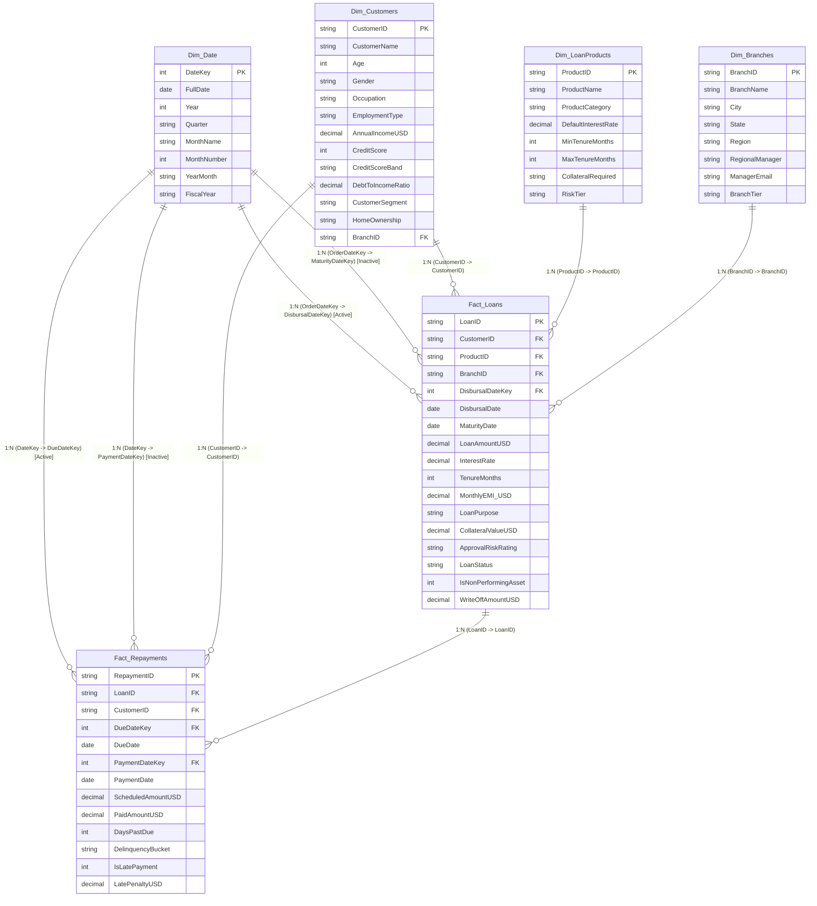

# 02. Data Model Architecture & Schema Design

## 1. Enterprise Star Schema Architecture

The FinPulse 360 data model is structured strictly as an **optimized Star Schema** around two core fact tables and four dimension tables. This design maximizes query performance under Power BI's in-memory columnar **VertiPaq Engine**.

---

## 2. Model Relationships Matrix

| From Table (Dimension) | To Table (Fact) | From Column (PK) | To Column (FK) | Cardinality | Cross-Filter Direction | Relationship State |
| :--- | :--- | :--- | :--- | :--- | :--- | :--- |
| **Dim_Date** | **Fact_Loans** | `DateKey` | `DisbursalDateKey` | 1 to Many (`1:*`) | Single (`Dim -> Fact`) | **Active** |
| **Dim_Date** | **Fact_Loans** | `DateKey` | `MaturityDateKey` | 1 to Many (`1:*`) | Single (`Dim -> Fact`) | *Inactive* (invoked via `USERELATIONSHIP`) |
| **Dim_Date** | **Fact_Repayments** | `DateKey` | `DueDateKey` | 1 to Many (`1:*`) | Single (`Dim -> Fact`) | **Active** |
| **Dim_Date** | **Fact_Repayments** | `DateKey` | `PaymentDateKey` | 1 to Many (`1:*`) | Single (`Dim -> Fact`) | *Inactive* (invoked via `USERELATIONSHIP`) |
| **Dim_Customers** | **Fact_Loans** | `CustomerID` | `CustomerID` | 1 to Many (`1:*`) | Single (`Dim -> Fact`) | **Active** |
| **Dim_Branches** | **Fact_Loans** | `BranchID` | `BranchID` | 1 to Many (`1:*`) | Single (`Dim -> Fact`) | **Active** |
| **Dim_LoanProducts** | **Fact_Loans** | `ProductID` | `ProductID` | 1 to Many (`1:*`) | Single (`Dim -> Fact`) | **Active** |
| **Fact_Loans** | **Fact_Repayments** | `LoanID` | `LoanID` | 1 to Many (`1:*`) | Single (`Loans -> Repay`) | **Active** |

---

## 3. VertiPaq Storage & Performance Optimization Best Practices

### Why This Design Excels in Technical Interviews:
1. **No Snowflake Hierarchies**: All branch geographic hierarchies (`City -> State -> Region`) are flattened into `Dim_Branches`. This avoids bridge tables and multi-hop relationship scans.
2. **Integer Date Keys (`YYYYMMDD`)**: Dates are linked via integer keys (e.g., `20240315`), which use significantly fewer bit-packs in memory compared to string or timestamp datatypes.
3. **Single Direction Filtering**: Every relationship is configured as **Single**, completely eliminating circular filtering ambiguities and performance degradation associated with Bi-directional cross-filtering.
4. **Separation of Granularities**:
   - `Fact_Loans`: Grain = 1 row per disbursed loan account.
   - `Fact_Repayments`: Grain = 1 row per monthly EMI billing cycle.
5. **Handling Inactive Relationships**: Role-playing dates (e.g., *Disbursal Date* vs *Payment Date*) are connected using inactive relationships and activated dynamically in DAX via `USERELATIONSHIP()`, avoiding redundant date tables.
