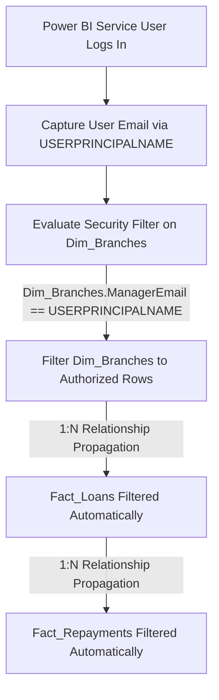

# 06. Enterprise Governance & Dynamic Row-Level Security (RLS)

## 1. Security Architecture & Business Need

In institutional banking, strict regulatory privacy mandates (GDPR, GLBA, SOX) dictate that branch managers must **only view customer and loan data originating from their own branch or assigned territory**, while Regional Directors and Executive C-Suite personnel retain aggregate multi-branch visibility.

---

## 2. Dynamic RLS Implementation via DAX & `USERPRINCIPALNAME()`

Instead of manually maintaining dozens of static regional security roles, **FinPulse 360** implements an automated **Dynamic Security Model**.



---

## 3. Step-by-Step RLS Configuration in Power BI Desktop

### Step 1: Define Role "Branch_Manager_Dynamic"
1. In Power BI Desktop, navigate to **Modeling** tab -> **Manage Roles**.
2. Click **Create** and name the role: `Branch_Manager_Dynamic`.
3. Select the `Dim_Branches` table and enter the following DAX filter expression:

```dax
[ManagerEmail] = USERPRINCIPALNAME()
```

### How It Works:
When user `s.jenkins@apexbank.com` opens the dashboard in the Power BI Service:
1. `USERPRINCIPALNAME()` returns `"s.jenkins@apexbank.com"`.
2. `Dim_Branches` filters to row `BR-101` (Downtown Manhattan Financial Center).
3. Via the active `1:Many` relationship between `Dim_Branches` and `Fact_Loans`, all loan records and linked repayment records for other branches are filtered out before reaching any visual!

---

### Step 2: Define Static Regional Director Roles (Optional Fallback)
For Regional Directors overseeing multiple branches:

1. Role: `Director_East_Region`
   - Table: `Dim_Branches`
   - DAX Filter:
   ```dax
   [Region] = "East"
   ```

2. Role: `Director_West_Region`
   - Table: `Dim_Branches`
   - DAX Filter:
   ```dax
   [Region] = "West"
   ```

3. Role: `Executive_Audit_Global`
   - Table: `Dim_Branches`
   - DAX Filter: *(No filter applied - full enterprise access)*

---

## 4. Testing & Validating RLS in Power BI Desktop

To verify RLS before publishing to Power BI Service:
1. Go to **Modeling** tab -> **View As**.
2. Check the box for **Other User** and enter: `d.miller@apexbank.com` (Chicago Branch Manager).
3. Check the box for `Branch_Manager_Dynamic`.
4. Click **OK**.
5. **Expected Result**: All KPI cards, charts, and tables immediately recalculate to reflect only Chicago Loop branch loans (~$42M disbursed, ~350 loans).

---

## 5. Publishing and Assigning Security in Power BI Service

```
Power BI Desktop (.pbix) ──► Publish to Workspace ──► Power BI Service Dataset Security
                                                             │
                                   ┌─────────────────────────┴────────────────────────┐
                                   ▼                                                  ▼
                     [Branch_Manager_Dynamic Role]                      [Director_East Role]
                     Add Azure AD Security Group:                       Add Azure AD Security Group:
                     'SG-All-Branch-Managers'                           'SG-East-Regional-Leads'
```

1. Publish report to the target workspace (e.g., `Apex_Risk_Analytics_Prod`).
2. In Power BI Service, locate the Semantic Model (Dataset) -> Click `...` -> **Security**.
3. Select `Branch_Manager_Dynamic` role and add Azure Active Directory (Microsoft Entra ID) security group: `SG_Branch_Managers`.
4. Add members and click **Save**.
